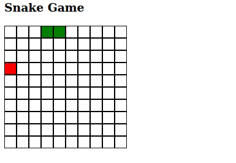

# Snake Game

This is a simple Snake Game built with HTML Canvas and Javascript.

The main proposal of this project is to provide an example of how to develop a human-readable code. So, the code you will see here may not be the more performative one but it is supposed to be easy to understand and to maintain (focus on the developer).



## How to install
No installation is required. Just [download](https://github.com/andre-luiz-pires-silva/snake-javascript-canvas/archive/refs/heads/master.zip) and open the file index.html on the browser.

You can also access the published version here: https://andre-luiz-pires-silva.github.io/snake-javascript-canvas/

Have fun!

## Components of the Game

The game is made up of the following 3 components:
### Grig

Well, the Grid is a grid. It's the representation of the area where the game is played.

Attributes:
- `positions`: A multidimensional array (a matrix) that has all the possible positions (x and y coordinates) where the snake can move to.

Functions:

- `draw()`: Renders one rectangle for each position.


### Apple

This is a very simple one.

Attributes:
 - `position`: Coordinates where the apple is located inside the grid.

Functions:
- `draw()`: Renders a red rectangle on the grid on it's position.


### Snake

Attributes:
- `positions`: An array with the coordinates where each of the Snake cell is.
- `direction`: The direction where the Snake is moving to. The direction is represented by `x` and `y` axes. The options are:
```javascript
const directions = {
  up: { x: 0, y: -1 },
  down: { x: 0, y: 1 },
  right: { x: 1, y: 0 },
  left: { x: -1, y: 0 }
};
```
The `x` and `y` axes have the values that must be added to the positions matrix indexes to get the next position on the desided direction. For instance:

Given the current position like this:

```javascript
let currentPosition = positions[2][3];
```
if we want to move `down` we would have something like this:

```javascript
let nextPosition = positions[2 + directions.down.x][3 + directions.down.y];
```

That would be like:

```javascript
let nextPosition = positions[2+0][3+1];
```

And would result in:
```javascript
let nextPosition = positions[2][4];
```

Functions:

- `draw()`: Renders green rectangles in all cells where the Snake body is (all the positions stored in `positions` attribute).

- `move()`: It moves the Snake according to the `direction` attribute. Aditionally it perform the following actions:
  - Checks if the next posistion where the snake will move to is valid. If not, it means that the Snake will crash on the grid's border, so GAME OVER.
  - Checks if the next position has part of the snake's body. If so, it means that the snake will crash on itself. GAME OVER.
  - Checks if the next position has an apple. If it has, this apple is eaten (it desapears and the snake grow one cell) and a new apple is created on a new random position.
  - Checks if there is no new position to create an apple. If so, it means that the snake took all the grid positions and then, YOU WIN!


## How the game works

No big deal, here is the sequence of what is done to get the game running:

### Add Key Listener

We use the `document.addEventListener` to track the `keydown` events and update the snake `direction` attribute when the user presses one of the arrow keys.

### Initialization

The function `initialize()` sets the canvas size, create the instances for the objects (`grid`, `snake`, `apple`) and starts the game loop.


### Loop
The funcion `loop()` is registered on a `setInterval` created on the initialization. It will be called every 200 milliseconds until the game ends. This will be like the game has 5 FPS (frames per second). Here is what this function does on each iteration:
  - Clear the canvas.
  - Call the function `move()` of the `snake` object.
  - Call the function `draw()` of all the objects (`grid`, `snake`, `apple`) so that we can see the game animation and play it.